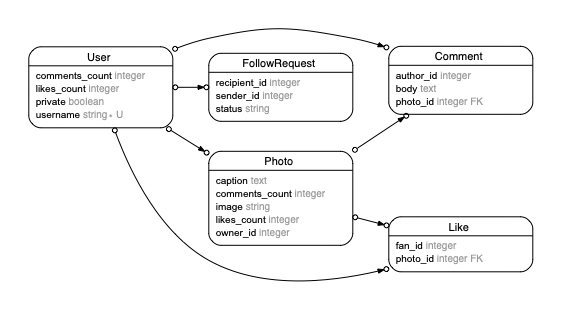

# Photogram Associations

## Getting started

In this project, we'll re-write our association accessor methods using [ActiveRecord's powerful Association helpers](https://guides.rubyonrails.org/association_basics.html).

The target is the same as Photogram GUI, but you shouldn't need the target for this refactoring project: 

[photogram-gui.matchthetarget.com](https://photogram-gui.matchthetarget.com/)

This project includes automated tests, so click on this button to get started:

LTI{Load Photogram Associations assignment}(https://grades.firstdraft.com/launch)[S9ymPy6WCsn18gLbByVbZQ7k]{vfdtzJb5bLYqYwuqgeRKpc5d}(5)[Photogram Associations Project]

The starting point code is one possible solution for `photogram-gui`. That means most of the `rake grade` specs should already be passing. However, since we will refactor our association accessor instance methods with `has_many` and `belongs_to`, there are a number of specs that are not passing yet.

## Domain model

For a quick overview of your database, here is the entity relationship diagram (ERD):



You can also always look at the comments at the top of each of your models in `app/models` to remind yourself of what columns it has.

## Refactoring

All of the work for this project will be done in the model files:

- `app/models/comment.rb`
- `app/models/follow_request.rb`
- `app/models/like.rb`
- `app/models/photo.rb`
- `app/models/user.rb`

If you open any of them, you will see some comments about the direct and indirect associations you should add, e.g.:

```ruby{7-13}
# app/models/comment.rb

# ...
class Comment < ApplicationRecord
  validates(:commenter, { :presence => true })

  # Association accessor methods to define:
  
  ## Direct associations

  # Comment#commenter: returns a row from the users table associated to this comment by the author_id column

  # Comment#photo: returns a row from the photos table associated to this comment by the photo_id column
# ...
```

Use this tool to help plan out your new association methods:

[https://association-accessors.firstdraft.com/](https://association-accessors.firstdraft.com/)

You may also want to read up again on [the `:through` and `:source` keywords from our previous refactoring of Must See Movies](https://learn.firstdraft.com/lessons/156-refactoring-msm-gui-2#the-source-and-through-keywords).

Note that our `association-accessors.firstdraft` tool doesn't yet support Scoped Associations. As a stretch goal, [read up on them here](https://remimercier.com/scoped-active-record-associations/) and see if you can figure out how to use them to build `accepted_sent_friend_requests`, `leaders`, `feed`, and `discover`.

## Solution

Try to make progress on your own and think through the associations carefully. When you get stuck, glance at the [solutions on this pull request](https://github.com/appdev-projects/photogram-associations/pull/2/files). 

---
